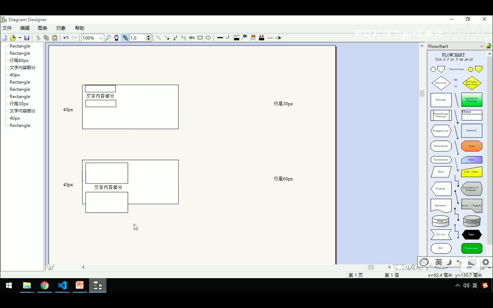
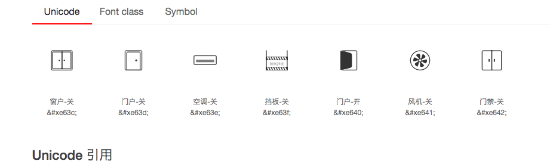

[toc]


# css

## css选择器

- 标签选择器
- id，#{}
- 类选择器 .{}
- 通配符选择器 *{}


复合选择器

- 后代选择器  :元素1 元素2 

```css
ul li{}
```

- 并集选择器
- 子选择器
- 伪类选择器

```html
<!DOCTYPE html>
<html>
<head>
<style>
a:hover
{
background-color:yellow;
}
</style>
</head>
<body>

<a href="http://www.w3school.com.cn">W3Sschool</a>
<a href="http://www.google.com">Google</a>
<a href="http://www.wikipedia.org">Wikipedia</a>

<p><b>注释：</b>:hover 选择器鼠标指针在其上浮动的链接设置样式。</p>

</body>
</html>


```


- 字体属性

- ```css
  font-family:规定文本的字体系列。
  font-size:规定文本的字体尺寸。
  font-weight :规定字体的粗细。
  ```

- 

- 文本属性

```css
text-align:cent,left,right，文本对齐的属性值
text-decoration:规定添加到文本下划线情况。none,underline (可以修改a标签的下划线)
color :设置文本的颜色
text-indent: 规定文本块首行的缩进。2em 表示两个字的缩进
line-height:26px 行与行之间的距离
```


- 


## 引入css的三种方法

- 内部样式  

```html
<p style="line-height: 26px;">hello</p>
```


- 行内样式
- 外部样式

```html
<link rel="stylesheet" href="b.css">
```


## 谷歌调试工具的使用

重点：

- 使用调试工具排查错误

```
用最左边的那个鼠标选中一个元素，会在右边出现一个style样式，如果没有，则该样式有问题（），如果出现了样式，该样式的属性出现了一个横线，则该属性有问题，谷歌会显示在第几行报的错
```


- 使用调试工具在不改变源码情况下更改页面样式

```
用最左边的那个鼠标选中一个元素，会在右边出现一个style样式，可以修改
不会对源码产生影响
```


## Emmet语法

- *

```
乘以div*4
```


- +

```
div+p  p和div是兄弟节点
```


- .

```
  div.demo    div标签中的类名为demo
```


- $

```
 ul>li.item$*5       
 div.demo$*5
 div#demo$*9
```


- {}

```
{}往里面加文本
div*5{helloworld}
```


- #

  ```
  div#demo1    id为demo1的div
  ```

  

- >

```
ul>li*5   
```


## 

## 元素显示模式

行内元素和块元素

***<!--重点-->***

行内元素：可以独占一行

h1  p div 是常见的块元素

- 特点
- 行内元素的大小可以设置	
- 默认的宽度是body的宽度
- 除了p  h1 这些元素外，可以往里面添加其他元素


- 特点：
- <!--**宽和高设置没有效果的**-->
- **行内元素只能放文本**，不能放块元素，可以放其他行内元素

h1和p中只能放文字不能放块元素


注意a**标签中可以放块元素**，一般用时，行转块


行内块元素

特点：

- 一行可以放多个
- 可以设置宽度和高度


行元素，行内块元素，块元素，之间的相互转换

- ——》块  display:block
- ->行   display :inline
- --->行内块  display:inline-block


使文本垂直居中

line-height:元素的高度

````html
<!DOCTYPE html>
<html lang="en">
<head>
    <meta charset="UTF-8">
    <meta name="viewport" content="width=device-width, initial-scale=1.0">
    <title>Document</title>
</head>
<style>
    p{
background-color: aqua;
height: 50px;
line-height: 50px;
display: block;
}
</style>
<body>
<p>hello√world</p>
    
    
    
</body>

</html>
````

原理 :行元素本来是居中的，把他的height改了后，当高度大于line-height时，会往上偏，反之往下，




## CSS 背景属性（重点）


| [background](https://www.w3school.com.cn/cssref/pr_background.asp) | 在一个声明中设置所有的背景属性。                 | 1    |
| ------------------------------------------------------------ | ------------------------------------------------ | ---- |
| [background-attachment](https://www.w3school.com.cn/cssref/pr_background-attachment.asp) | 设置背景图像是否固定或者随着页面的其余部分滚动。 | 1    |
| [background-color](https://www.w3school.com.cn/cssref/pr_background-color.asp) | 设置元素的背景颜色。                             | 1    |
| [background-image](https://www.w3school.com.cn/cssref/pr_background-image.asp) | 设置元素的背景图像。                             | 1    |
| [background-position](https://www.w3school.com.cn/cssref/pr_background-position.asp) | 设置背景图像的开始位置。                         | 1    |
| [background-repeat](https://www.w3school.com.cn/cssref/pr_background-repeat.asp) | 设置是否及如何重复背景图像。                     | 1    |
| [background-clip](https://www.w3school.com.cn/cssref/pr_background-clip.asp) | 规定背景的绘制区域。                             | 3    |
| [background-origin](https://www.w3school.com.cn/cssref/pr_background-origin.asp) | 规定背景图片的定位区域。                         | 3    |
| [background-size](https://www.w3school.com.cn/cssref/pr_background-size.asp) | 规定背景图片的尺寸。                             | 3    |

<!--重点-->

background-position

参数															描述

| top lefttop centertop rightcenter leftcenter centercenter rightbottom leftbottom centerbottom right | 如果您仅规定了一个关键词，那么第二个值将是"center"。默认值：0% 0%。 |
| ------------------------------------------------------------ | ------------------------------------------------------------ |
| x% y%                                                        | 第一个值是水平位置，第二个值是垂直位置。左上角是 0% 0%。右下角是 100% 100%。如果您仅规定了一个值，另一个值将是 50%。 |
| xpos ypos                                                    | 第一个值是水平位置，第二个值是垂直位置。左上角是 0 0。单位是像素 (0px 0px) 或任何其他的 CSS 单位。如果您仅规定了一个值，另一个值将是50%。您可以混合使用 % 和 position 值。 |

值可以参考w3school


**background-attachment **

实现背景图不跟页面的内容滚动而滚动


### 背景色半透明

```cs
background-color: rgba(0, 0, 0, 0.5);  //最后一个代表透明度50%
```

background-image和image的区别

background-image更容易控制位置，常用于小图片，logo，和精灵图


## css三大特性

- 层叠性：最近的css
- 继承性：子标签继承父标签的css样式
- 优先级


复合选择器会对优先级权重进行叠加


## 盒子模型

由四部分组成

- 边框
  - CSS 边框属性（Border )
  - border-color  参考w3cshool
  - border-style
  - border-width
  - ==注意==：给border边框设置大小时会影响整个盒子的大小
  
- 外边距

  - margin  : 0 auto  这个auto代表左右的外边距相等，同理auto可以用于上下
  - margin

- 内边距

  - ==注意==内边距会影响整个盒子的大小
  - 保持原来的大小：width，height减去多出来的长度
  - 好处：盒子会根据内容的增多而变大，看起来会很舒服
  - 坏处：盒子变大需要重新计算盒子的宽度跟高度
  - div 和p当没有指定width时，padding不会将宽度增加

- 

- 


## 行内块元素和块元素的居中方法

行内块元素  text-align:center;

行内块元素,就可以看成一个行内元素，居中就是文本居中

块元素 margin :auto top ;块元素独占一行，左右外边距相等就是居中


外边距塌陷问题

父盒子里面有个子盒子，两同时有margin top时，父盒子会选择一个margin大的值。


行内元素一般不设置上下外边距，因为没有效果


网页元素通常都自带内外边距如 p,ul ,而且不同的浏览器，值可能不同，所以如下：

```css
*{
  margin:0px;
  padding:0px
  /* css的第一段代码，便于我们修改内外边距*/
}
```


## ps基础操作

- 取色

- 测量

- 拖动图片，放大缩小图片

  245，315


list-style:none

## css3边框


- border-radius：圆角边框：
- box-shadow ：css3阴影  ==重点==


## css定位

为什么要浮动：

使用之前学的，无法将div排成一行，就算使用行内块元素，div之间也会有空隙，

很难控制，所以需要浮动


浮动重难点：

- 浮动会使原来的元素脱离标准流（脱标），浮动的盒子会浮在最上面

- 浮动的位置将不会被保留

```html
<!DOCTYPE html>
<html lang="en">
<head>
    <meta charset="UTF-8">
    <meta name="viewport" content="width=device-width, initial-scale=1.0">
    <title>Document</title>
    <style>
        #p{
            float: left;
            background-color: aqua;
            width: 300px;
            height: 300px;
        }

        #o{
background-color: blue;
width: 400px;
height: 400px;
        }
    </style>
</head>
<body>
    <div id="p"></div>
    <div id="o"></div>
</body>
</html>
```

- 浮动的元素会排成一行，如果一行排不下了，会另起一行	
- div和一些块元素，加上了float后，如果没有给width，会具有行内块元素的特性（宽度随内容的增加而增加）

- 浮动经常搭配父盒子使用 


folat: left 如果没有父盒子 浮动到浏览器左边缘

folat: right 如果没有父盒子浮动到浏览器右边缘


folat注意两个：

	- 一般搭配父盒子使用
	- 一浮全浮，盒子里面的一个元素浮动，则里面所有的元素都要浮动，否则没有效果
	- 浮动只会影响后面的标准流，不会影响前面的标准流


### 	清除浮动

当父盒子的高度为0时，里面的浮动的元素会跑出父盒子，解决办法：清除浮动

方法：

- overflow ：hidden 给父标签加一个样式
- 添加标签的方法，一般不常用，在父盒子里面放一个标签
- after伪元素法  自己去百度

## 定位

### 相对定位 relative

- 相对定位：移动是依据自己原来的位置移动

  - ````html
    <!DOCTYPE html>
    <html>
    <head>
    <meta charset="utf-8"> 
    <title>菜鸟教程(runoob.com)</title> 
    <style>
    h2.pos_left
    {
    	position:relative;
    	left:-20px;
    }
    
    h2.pos_right
    {
    	position:relative;
    	left:20px;
    }
    </style>
    </head>
    
    <body>
    <h2>这是位于正常位置的标题</h2>
    <h2 class="pos_left">这个标题相对于其正常位置向左移动</h2>
    <h2 class="pos_right">这个标题相对于其正常位置向右移动</h2>
    <p>相对定位会按照元素的原始位置对该元素进行移动。</p>
    <p>样式 "left:-20px" 从元素的原始左侧位置减去 20 像素。</p>
    <p>样式 "left:20px" 向元素的原始左侧位置增加 20 像素。</p>
    </body>
    
    </html>
    ````

  - 

- 不脱标，原来的位置依旧保留


### 绝对定位

如果父元素没有定位，会根据浏览器进行定位，如果祖先元素有定位，则以祖先元素的位置进行绝对定位，相当于祖先元素约束绝对定位

````html
#box_relative {
  position: absolute;
  left: 30px;
  top: 20px;
}
````

绝对定位的居中算法，先移动父盒子的一半，再移动自己的一半

### 固定定位

- 1以浏览器的可视窗口作为参照元素
- 2不随滚动条滚动而滚动
- 3不占有原来的位置


## 定位叠加顺序

z-index:1    z-index:2     z-index:3

数字越小，顺序越高	


浮动与定位的区别

浮动不会压入文字

定位会压入文字

 

## 元素的显示与隐藏

- 隐藏 display：none  此元素不会被显示。（不会占用原来的位置）
- 显示 display: block ，显示


### visibility

-  visible 默认值。元素是可见的。
- hidden 元素不可见（会占用原来位置）

### overflow

对溢出的部分进行显示或隐藏

- overflow: auto;根据内容是否被裁剪，是否加上滚动条
-  overflow: hidden;内容会被修剪，并且其余内容是不可见的。
-  overflow: scroll;内容会被修剪，但是浏览器会显示滚动条以便查看其余的内容。
-  overflow: visible; 默认情况下，overflow 的值为 visible， 意思是内容溢出元素框：


定位不要加 overflow :hidden，因为定位可能需要 超出原来的盒子


## css高级技巧

## 精灵图

原来页面上每一个图片，服务器都会发送一个请求，如此一来，如果页面上的图片很多，服务器会发送很多次请求。如果访问人数一多，服务器会有很大的压力。

解决方案：

可以把多个小图片放到一个大的图片中，这样只需访问一次图片，就可以得到所有想要加载的图片了。

[测量工具](http://www.spritecow.com/)


## 字体图标

一些简单的图标，本质是text，当我们需要时，可以去下载使用[alimama地址](https://www.iconfont.cn/collections/index?spm=a313x.7781069.1998910419.8&type=3)


步骤

- 1.将下好的文件丢到我们的项目根目录

- 2拷贝项目下面iconfont.css的 `@font-face `代码

  - ```css
    @font-face {font-family: "iconfont";
      src: url('iconfont.eot?t=1597481515774'); /* IE9 */
      src: url('iconfont.eot?t=1597481515774#iefix') format('embedded-opentype'), /* IE6-IE8 */
      url('....') format('svg'); /* iOS 4.1- */
    }
    ```

- 3引入样式

  - ```css
    span{
        font-family: iconfont;
    }
    ```

  - 4  打开demo_index.html,拷贝unicode编码

  - 




### css三角

```html
   <style>
.j{
     width: 0px;
     height: 0px;  
    border: 3px solid transparent;
    border-bottom-color: brown;
 /* 上面是简化版*/
     /* border-top: transparent solid 5px;
    
     border-left: transparent solid 5px;
     border-right: transparent solid 5px;
     border-bottom: brown solid 5px; */
     position: absolute;
     top: -5px;
     right: 10px;
    }

    #oo{
        position: relative;
        width: 45px;
        height: 88px;
        background-color: brown;
    }
     
        <div id="oo">
        <div class="j"></div>
    </div>
```


### 鼠标样式

cursor属性

- cursor:help
- cursor :


```css
textarea{
    resize: none;
    outline: none;
}
```


### vertical-align使用

div里面的图片最底部有空隙

解决方法

````html
 
````


### 文字单行溢出和多行溢出

单行溢出：

```css
#vv{
    width: 150px    ;
    height: 80px;
    background-color: aqua;
    white-space: nowrap;
    overflow: hidden;
    text-overflow: ellipsis;
}
```

多行溢出：


巧用行内块元素

​	